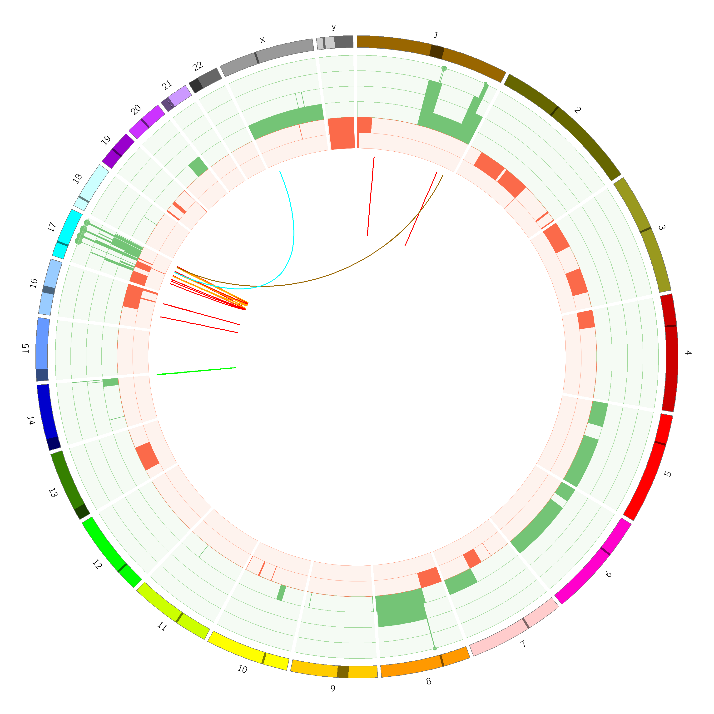
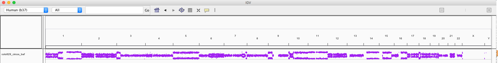

```{r setup, include = FALSE}
knitr::opts_chunk$set(
  collapse = TRUE,
  comment = "#>",
  fig.path = "man/figures/README-",
  out.width = "100%"
)
```

[](https://travis-ci.org/pdiakumis/rock)

Rocking R at UMCCR
==================

`rock` is an R package that (hopefully) helps with the day to day bioinformatics
life at UMCCR (UniMelb Centre for Cancer Research).

You can do the following:

* Create [Perl circos](http://circos.ca/) plots using structural variant calls from
  [Manta](https://github.com/Illumina/manta),
  and copy number variant calls from
  [CNVkit](https://github.com/etal/cnvkit) or
  [PURPLE](https://github.com/hartwigmedical/hmftools/tree/master/purity-ploidy-estimator).

* Create CNV profiles in horizontal facets for multiple samples or callers (piano plots).
  Can also zoom into specific chromosomes, and include an ideogram when specifying
  a single chromosome.
  
* Generate bedgraph files for viewing the copy number segments 
  in [IGV](http://software.broadinstitute.org/software/igv/) as a bar plot.
  
* Generate IGV files for viewing SNP values in IGV as a scatter plot.


## Contents

## Installation

### devtools

You can install the development version of `rock` from [GitHub](https://github.com/pdiakumis/rock) with:

```r
# install.packages("devtools") # if not pre-installed
devtools::install_github("pdiakumis/rock") # master version
devtools::install_github("pdiakumis/rock@v1.2.3") # release v1.2.3
devtools::install_github("pdiakumis/rock@abcd") # commit abcd
```

```{r message=FALSE}
require(rock)
```

### conda

There is a conda package version at <https://anaconda.org/pdiakumis/r-rock>
which is updated regularly.

You need to create a conda environment, and then install with something like:

```bash
conda install -c pdiakumis r-rock
```

## Circos Plots

We can generate circos plots using the original [circos](http://circos.ca/)
software package, written in Perl.
  
`circos` needs to be installed in your `PATH` for it to work straight from within `rock`.
I've had a terrible time trying to install `circos` either from source or
from conda. The only way that I've found to consistently work is through Docker.
  
I have a docker image available on [DockerHub](https://hub.docker.com/r/pdiakumis/circos),
which you can pull (`docker pull pdiakumis/circos:0.69-6`) and then run as shown below. 


### Input preparation
Start by preparing the Manta and CNVkit calls. The required input files will be written to `outdir`:

```{r perlcircos-prep}
manta <- system.file("extdata", "HCC2218_manta.vcf", package = "pebbles")
cnvkit <- system.file("extdata", "HCC2218_cnvkit-call.cns", package = "pebbles")
outdir <- "man/figures/perl_circos"
rock::circos_prep(outdir = outdir, manta = manta, cnv = cnvkit)
```

### Run Circos
Now comes the fun part of running the `circos` command.
Depending on if you've managed to install a working version of `circos` or
if you want to use the Docker version, you have the following options:

* If you can find `circos` in your R session, just run the following R command.
  If you're an RStudio user, you can make sure it recognises the user's PATH by
  opening the RStudio app via the terminal, or perhaps following the suggestions
  here: https://stackoverflow.com/questions/31121645

```{r perlcircos-plot, eval=FALSE}
plot_circos(outdir = outdir, name = "my_fabulous_plot")
```

* If you just want to run it on your command line, adjust the following BASH command:

```bash
circos -nosvg -conf <outdir>/circos_simple.conf -outputdir <outdir> -outputfile my_fabulous_plot_circos.png
```

* If you want to run the Docker version on your command line from the `outdir`:

```bash
docker container run --rm -v $(pwd):/data pdiakumis/circos:0.69-6 -conf /data/circos.conf -outputdir /data
```

* Result:

```{r perlcircos-include}

```

## Piano Plots

* We can generate 'piano' plots to compare CNV calls from multiple
  callers or samples.
  
* Start by preparing the SV and CNV calls.

```{r omiccircos-prep, message=FALSE}
manta <- system.file("extdata", "HCC2218_manta.vcf", package = "pebbles")
cnvkit <- system.file("extdata", "HCC2218_cnvkit-call.cns", package = "pebbles")
facets <- system.file("extdata", "HCC2218_facets_cncf.tsv", package = "pebbles")
titan <- system.file("extdata", "HCC2218_titan.segs.tsv", package = "pebbles")
purple <- system.file("extdata", "HCC2218_purple.cnv.tsv", package = "pebbles")
truth <- system.file("extdata", "HCC2218_truthset_cnv_bcbio.tsv", package = "pebbles")
sv_manta <- prep_manta_vcf(manta)
cn_facets <- prep_facets_seg(facets)
cn_cnvkit <- prep_cnvkit_seg(cnvkit)
cn_purple <- prep_purple_seg(purple)
cn_truth <- prep_truth_seg(truth)
cn_titan <- prep_titan_seg(titan) # titan needs -1 for this case
cn_titan$cnv$tot_cn <- cn_titan$cnv$tot_cn - 1
```
  
```{r piano-plot-cnvkit-facets-purple-titan1, fig.width=10, fig.height=7}
cnv_list <- list(truth = cn_truth, cnvkit = cn_cnvkit, facets = cn_facets, purple = cn_purple, titan = cn_titan)
plot_piano(cnv_list = cnv_list)
```
  
* You can also zoom into specific chromosomes:

```{r piano-plot-chrom, fig.width=10, fig.height=7}
plot_piano(cnv_list = cnv_list, chromosomes = c("1", "7", "8"), hide_x_lab = FALSE)
```

* Change colours of the CNV segments:

```{r piano-plot-chrom-colours, fig.width=10, fig.height=7}
plot_piano(cnv_list = cnv_list, chromosomes = c("1", "7", "8"),
           seg.col = c("orange", "lightblue", "blue", "pink"), hide_x_lab = FALSE)
```

* And even plot an ideogram of the chromosome:

```{r piano-plot-chrom-ideo, fig.width=10, fig.height=7}
require(patchwork)
plot_ideogram(chrom = "13") +
  plot_piano(cnv_list = cnv_list,
             chromosomes = "13", hide_x_lab = FALSE) +
  plot_layout(ncol = 1, heights = c(1, 15))
```

  
## View CNV segments in IGV

```{r prep-cnv2igv, eval=FALSE}
cn_fname <- system.file("extdata", "HCC2218_purple.cnv.tsv", package = "pebbles")
cnv <- read_cnv(cn_fname)
cnv2igv(cnv, out_file = "~/Desktop/tmp/cnv_segs4igv.bedgraph", track_name = "cnv_segs2")
```

```{r cnv2igv}
knitr::include_graphics("man/figures/README-cnv2igv_output.png")
```

## View BED values in IGV

```{r prep-bedval2igv, eval=FALSE}
bed <- system.file("extdata", "HCC2218_baf.tsv", package = "pebbles")
bedval2igv(bed, out_file = "~/Desktop/tmp/baf1.igv", track_name = "baf", col = "purple")
```

```{r bedval2igv}
# example for COLO829 whole-genome BAFs

```
