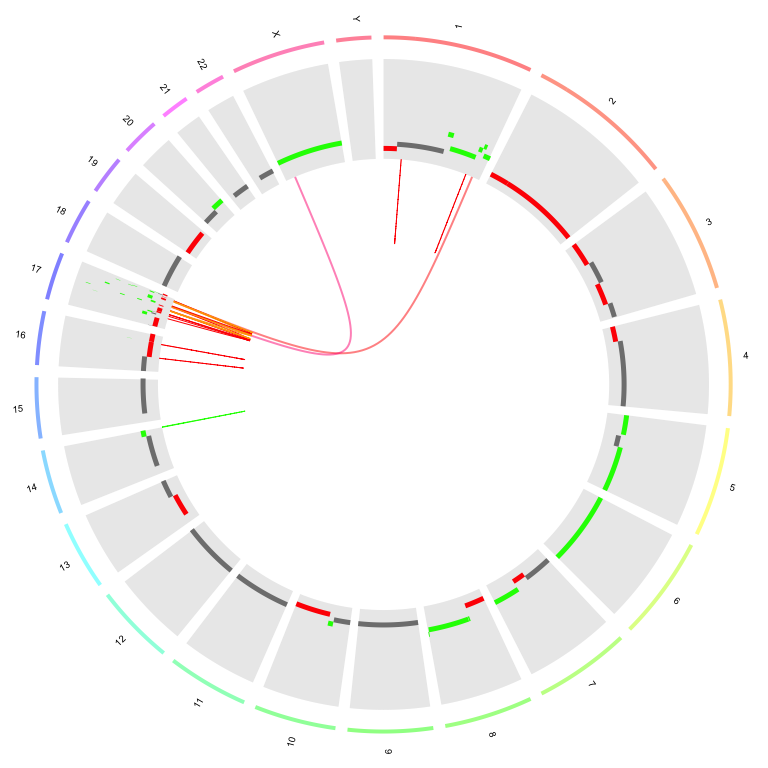
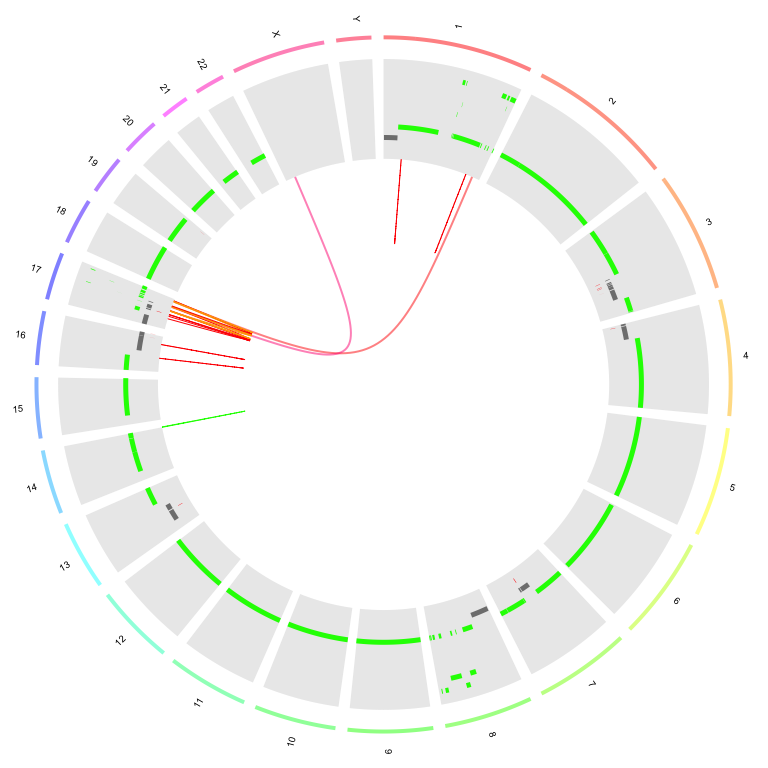

# Rocking R at UMCCR

[](https://travis-ci.org/umccr/rock)
[](https://codecov.io/github/umccr/rock?branch=master)

`rock` is an R package that (hopefully) helps with the day to day
bioinformatics life at UMCCR (UniMelb Centre for Cancer Research).

You can do the following:

  - Create circos plots using structural variant calls from
    [Manta](https://github.com/Illumina/manta), and copy number variant
    calls from [CNVkit](https://github.com/etal/cnvkit),
    [FACETS](https://github.com/mskcc/facets),
    [TitanCNA](https://github.com/gavinha/TitanCNA) or
    [PURPLE](https://github.com/hartwigmedical/hmftools/tree/master/purity-ploidy-estimator).
    The OmicCircos R package is used.

  - Create CNV profiles in horizontal facets for multiple samples or
    callers (piano plots)

## Contents

<!-- vim-markdown-toc GFM -->

* [Installation](#installation)
* [Circos Plots](#circos-plots)
    * [Manta with CNVkit](#manta-with-cnvkit)
    * [Manta with FACETS](#manta-with-facets)
    * [Manta with TitanCNA](#manta-with-titancna)
    * [Manta with PURPLE](#manta-with-purple)
* [Piano Plots](#piano-plots)

<!-- vim-markdown-toc -->

## Installation

You can install the development version of `rock` from
[GitHub](https://github.com/umccr/rock) with:

``` r
# install.packages("devtools") # if not pre-installed
devtools::install_github("umccr/rock") # master version
devtools::install_github("umccr/rock@v1.2.3") # release v1.2.3
devtools::install_github("umccr/rock@abcd") # commit abcd
```

There is no CRAN or conda version (yet).

Then just load with:

``` r
require(rock)
```

## Circos Plots

  - We can generate circos plots using the functionality available in
    the
    [OmicCircos](https://bioconductor.org/packages/release/bioc/html/OmicCircos.html)
    Bioconductor R package.

  - Start by preparing the SV and CNV
calls.

<!-- end list -->

``` r
manta <- system.file("extdata", "HCC2218_manta.vcf", package = "pebbles")
cnvkit <- system.file("extdata", "HCC2218_cnvkit-call.cns", package = "pebbles")
facets <- system.file("extdata", "HCC2218_facets_cncf.tsv", package = "pebbles")
titan <- system.file("extdata", "HCC2218_titan.segs.tsv", package = "pebbles")
purple <- system.file("extdata", "HCC2218_purple.cnv.tsv", package = "pebbles")

sv_manta <- prep_manta_vcf(manta)
cn_facets <- prep_facets_seg(facets)
cn_cnvkit <- prep_cnvkit_seg(cnvkit)
cn_titan <- prep_titan_seg(titan)
cn_purple <- prep_purple_seg(purple)
```

  - Now we can generate a circos plot with Manta links and
    FACETS/CNVkit/TitanCNA/PURPLE segments (note that the `Warning`
    message below is due to a hack used in the OmicCircos code, where a
    matrix with numbers and characters is coerced to numeric. Just don’t
    worry about it..):

  - For the internal lines:
    
      - The \_inter\_chromosomal links take the chromosome colour of
        mate1 of each breakend pair.
      - The \_intra\_chromosomal lines are coloured according to the
        variant type:
          - Deletions: Red
          - Duplications: Green
          - Insertions: Purple
          - Inversions: Orange

### Manta with CNVkit

``` r
plot_circos(sv = sv_manta, cnv = cn_cnvkit)
#> Warning in OmicCircos::circos(R = 260, cir = pebbles::circos_data$db, type
#> = "arc", : NAs introduced by coercion

#> Warning in OmicCircos::circos(R = 260, cir = pebbles::circos_data$db, type
#> = "arc", : NAs introduced by coercion
```


### Manta with FACETS

``` r
plot_circos(sv = sv_manta, cnv = cn_facets)
#> Warning in OmicCircos::circos(R = 260, cir = pebbles::circos_data$db, type
#> = "arc", : NAs introduced by coercion

#> Warning in OmicCircos::circos(R = 260, cir = pebbles::circos_data$db, type
#> = "arc", : NAs introduced by coercion
```



### Manta with TitanCNA

``` r
plot_circos(sv = sv_manta, cnv = cn_titan)
#> Warning in OmicCircos::circos(R = 260, cir = pebbles::circos_data$db, type
#> = "arc", : NAs introduced by coercion

#> Warning in OmicCircos::circos(R = 260, cir = pebbles::circos_data$db, type
#> = "arc", : NAs introduced by coercion
```



### Manta with PURPLE

``` r
plot_circos(sv = sv_manta, cnv = cn_purple)
#> Warning in OmicCircos::circos(R = 260, cir = pebbles::circos_data$db, type
#> = "arc", : NAs introduced by coercion

#> Warning in OmicCircos::circos(R = 260, cir = pebbles::circos_data$db, type
#> = "arc", : NAs introduced by coercion
```


## Piano Plots

  - We can generate ‘piano’ plots to compare CNV calls from multiple
    callers or
samples.

<!-- end list -->

``` r
plot_piano(list(cnvkit = cn_cnvkit, facets = cn_facets, purple = cn_purple, titan = cn_titan))
```


