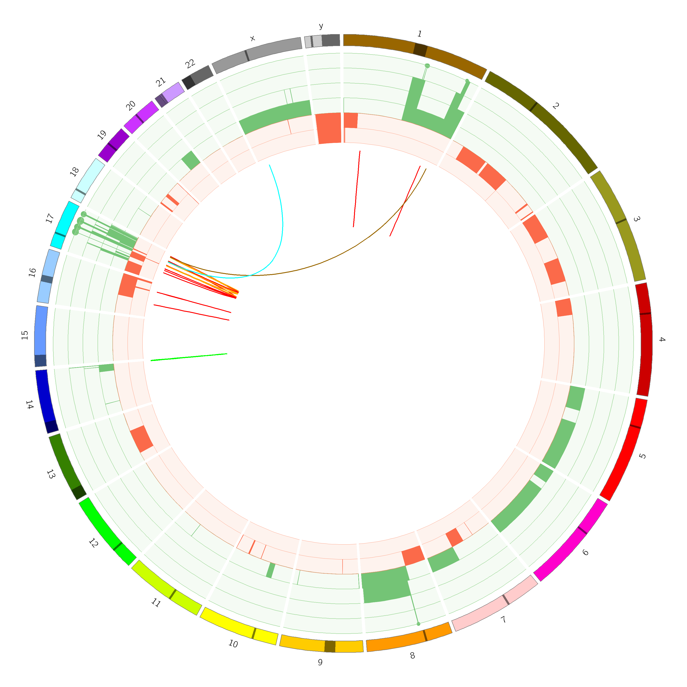
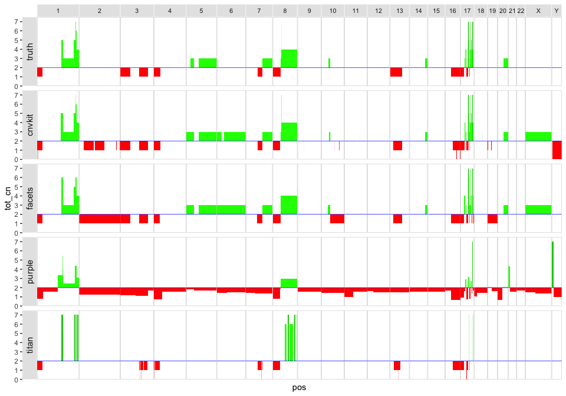
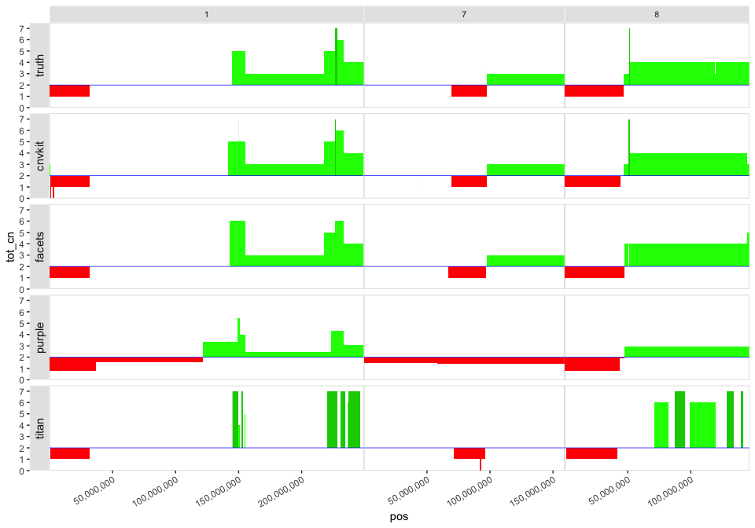
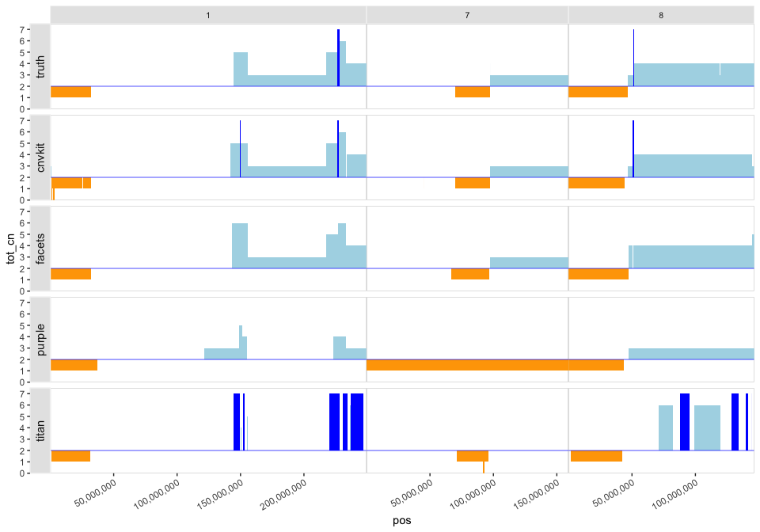
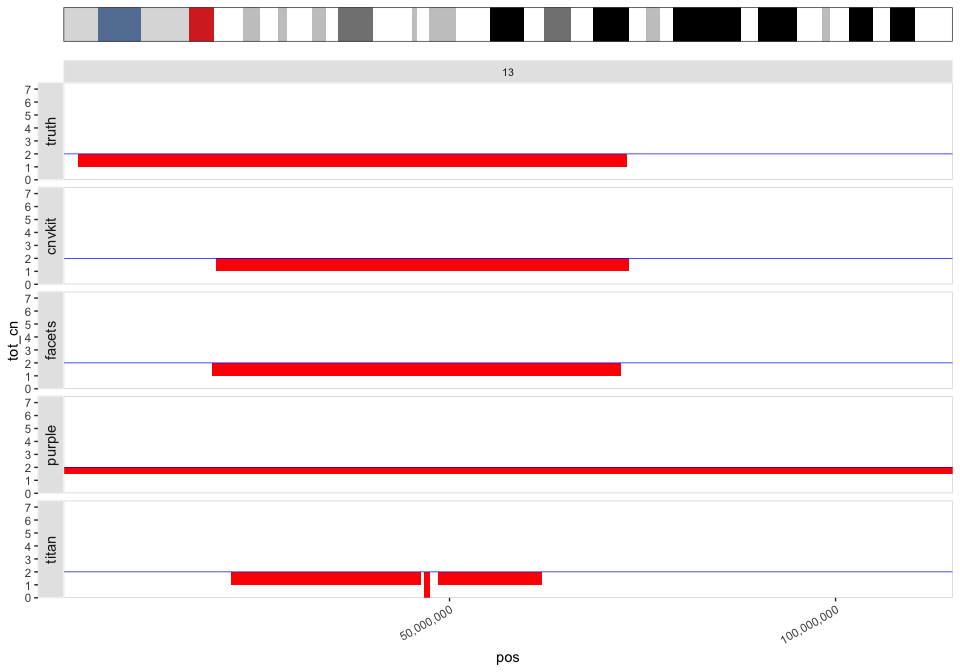
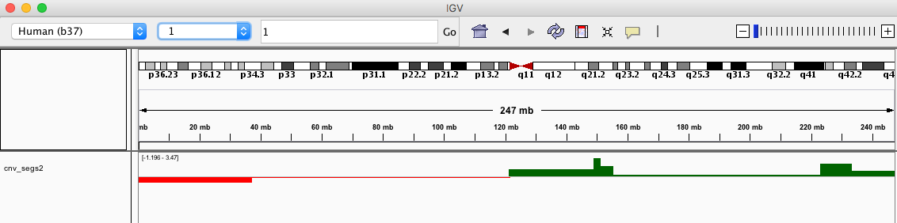
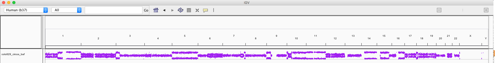

# Rocking R at UMCCR

`rock` is an R package that (hopefully) helps with the day to day
bioinformatics life at UMCCR (UniMelb Centre for Cancer Research).

You can do the following:

  - Create [Perl circos](http://circos.ca/) plots using structural
    variant calls from [Manta](https://github.com/Illumina/manta), and
    copy number variant calls from
    [CNVkit](https://github.com/etal/cnvkit) or
    [PURPLE](https://github.com/hartwigmedical/hmftools/tree/master/purity-ploidy-estimator).

  - Create CNV profiles in horizontal facets for multiple samples or
    callers (piano plots). Can also zoom into specific chromosomes, and
    include an ideogram when specifying a single chromosome.

  - Generate bedgraph files for viewing the copy number segments in
    [IGV](http://software.broadinstitute.org/software/igv/) as a bar
    plot.

  - Generate IGV files for viewing SNP values in IGV as a scatter plot.

## Contents

<!-- vim-markdown-toc GFM -->

* [Installation](#installation)
    * [devtools](#devtools)
    * [conda](#conda)
* [Circos Plots](#circos-plots)
* [Piano Plots](#piano-plots)
* [View CNV segments in IGV](#view-cnv-segments-in-igv)
* [View BED values in IGV](#view-bed-values-in-igv)

<!-- vim-markdown-toc -->

## Installation

### devtools

You can install the development version of `rock` from
[GitHub](https://github.com/pdiakumis/rock) with:

``` r
# install.packages("devtools") # if not pre-installed
devtools::install_github("pdiakumis/rock") # master version
devtools::install_github("pdiakumis/rock@v1.2.3") # release v1.2.3
devtools::install_github("pdiakumis/rock@abcd") # commit abcd
```

``` r
require(rock)
```

### conda

There is a conda package version at
<https://anaconda.org/pdiakumis/r-rock> which is updated regularly.

You need to create a conda environment, and then install with something
like:

``` bash
conda install -c pdiakumis r-rock
```

Note that this conda version can be used only with R v3.4.

## Circos Plots

  - We can generate circos plots using the original
    [circos](http://circos.ca/) software package, written in Perl.
    **Note**: `circos` needs to be installed in your `PATH`.

  - Start by preparing the Manta and CNVkit calls. The required input
    files will be written to
`outdir`:

<!-- end list -->

``` r
manta <- system.file("extdata", "HCC2218_manta.vcf", package = "pebbles")
cnvkit <- system.file("extdata", "HCC2218_cnvkit-call.cns", package = "pebbles")
outdir <- "man/figures/perl_circos"
circos_prep(outdir = outdir, manta = manta, cnv = cnvkit)
#> Warning in dir.create(outdir, recursive = TRUE): 'man/figures/perl_circos'
#> already exists
#> Exporting Manta and CNV circos files to 'man/figures/perl_circos'.
#> Copying circos templates to 'man/figures/perl_circos'.
```

  - Then execute the following `circos` command either on the command
    line, or via the `plot_circos2`
function:

<!-- end list -->

``` bash
circos -nosvg -conf <outdir>/circos_simple.conf -outputdir <outdir> -outputfile foo_circos_cnvkit_manta.png
```

``` r
plot_circos2(outdir = outdir, name = "foo")
```

  - Result:

<!-- end list -->

``` r

```


## Piano Plots

  - We can generate ‘piano’ plots to compare CNV calls from multiple
    callers or samples.

  - Start by preparing the SV and CNV
calls.

<!-- end list -->

``` r
manta <- system.file("extdata", "HCC2218_manta.vcf", package = "pebbles")
cnvkit <- system.file("extdata", "HCC2218_cnvkit-call.cns", package = "pebbles")
facets <- system.file("extdata", "HCC2218_facets_cncf.tsv", package = "pebbles")
titan <- system.file("extdata", "HCC2218_titan.segs.tsv", package = "pebbles")
purple <- system.file("extdata", "HCC2218_purple.cnv.tsv", package = "pebbles")
truth <- system.file("extdata", "HCC2218_truthset_cnv_bcbio.tsv", package = "pebbles")
sv_manta <- prep_manta_vcf(manta)
cn_facets <- prep_facets_seg(facets)
cn_cnvkit <- prep_cnvkit_seg(cnvkit)
cn_purple <- prep_purple_seg(purple)
cn_truth <- prep_truth_seg(truth)
cn_titan <- prep_titan_seg(titan) # titan needs -1 for this case
cn_titan$cnv$tot_cn <- cn_titan$cnv$tot_cn - 1
```

``` r
cnv_list <- list(truth = cn_truth, cnvkit = cn_cnvkit, facets = cn_facets, purple = cn_purple, titan = cn_titan)
plot_piano(cnv_list = cnv_list)
```



  - You can also zoom into specific
chromosomes:

<!-- end list -->

``` r
plot_piano(cnv_list = cnv_list, chromosomes = c("1", "7", "8"), hide_x_lab = FALSE)
```



  - Change colours of the CNV segments:

<!-- end list -->

``` r
plot_piano(cnv_list = cnv_list, chromosomes = c("1", "7", "8"),
           seg.col = c("orange", "lightblue", "blue", "pink"), hide_x_lab = FALSE)
```



  - And even plot an ideogram of the chromosome:

<!-- end list -->

``` r
require(patchwork)
#> Loading required package: patchwork
plot_ideogram(chrom = "13") +
  plot_piano(cnv_list = cnv_list,
             chromosomes = "13", hide_x_lab = FALSE) +
  plot_layout(ncol = 1, heights = c(1, 15))
```



## View CNV segments in IGV

``` r
cn_fname <- system.file("extdata", "HCC2218_purple.cnv.tsv", package = "pebbles")
cnv <- read_cnv(cn_fname)
cnv2igv(cnv, out_file = "~/Desktop/tmp/cnv_segs4igv.bedgraph", track_name = "cnv_segs2")
```

``` r

```


## View BED values in IGV

``` r
bed <- system.file("extdata", "HCC2218_baf.tsv", package = "pebbles")
bedval2igv(bed, out_file = "~/Desktop/tmp/baf1.igv", track_name = "baf", col = "purple")
```

``` r
# example for COLO829 whole-genome BAFs

```


